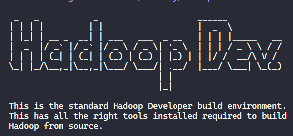
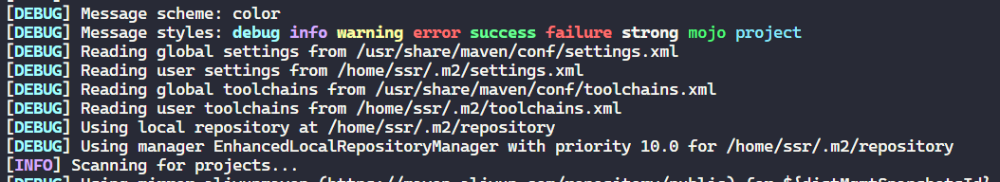

public:: true

- 从源码编译Hadoop
	- 环境：WSL2 Ubuntu-20.04.6-LTS，Docker 24.0.2
	- 从官网下载源码后解压：`tar -zxvf <filename>`
	- 查看`BUILDING.txt`
	- 执行`./start-build-env.sh`
	  collapsed:: true
		- `Dockerfile`换源：（若archive.ubuntu.com下载慢/超时）
		  ``` Dockerfile
		  RUN sed -i s:/archive.ubuntu.com:/mirrors.tuna.tsinghua.edu.cn/ubuntu:g /etc/apt/sources.list
		  RUN cat /etc/apt/sources.list
		  RUN apt-get clean
		  RUN apt-get -y update --fix-missing
		  ```
		- Dockerfile curl 代理：（若curl github.com下载慢/超时error）
		  collapsed:: true
		  
		  ``` Dockerfile
		  # curl -x <protocol>://<ip_addr>:<proxy_inbound_port> <target_addr>
		  curl -x socks5://172.30.208.1:1081 https://github.com/spotbugs/spotbugs/releases/download/4.2.2/spotbugs-4.2.2.tgz
		  ```
			- 设置本机代理：“允许来自局域网的连接”
			- 查看本机代理设置：protocol对应的入站端口
			- `cat /etc/resolv.conf`获取wsl ip 地址
		- Docker常用指令：
		  ```bash
		  # 启动daemon
		  sudo service docker start
		  # 清理
		  docker system prune --volumes
		  # 启动/删除镜像
		  docker run <image-name>
		  docker rmi <image-name>
		  # 启动/停止/删除容器
		  docker start <container-id>
		  docker stop <container-id>
		  docker rm <container-id>
		  ```
	- 脚本执行后自动进入容器，环境配置成功如图：
	  {:height 152, :width 311}
	- maven编译（选项可参考`BUILDING.txt`）
	  collapsed:: true
	  
	  ``` bash
	  mvn clean package -DskipTests -Pdist,native -Dtar
	  
	  # 从指定模块开始编译：(module对应源码中文件夹名)
	  # mvn <goal> -rf :<module>
	  mvn clean package -DskipTests -Pdist,native -Dtar -rf :hadoop-mapreduce-client-hs-plugins
	  ```
		- maven配置镜像源：（若maven下载jar包较慢）
		  
		  ``` Xml
		  <mirrors>
		    <mirror>
		  	<id>alimaven</id>
		  	<name>aliyun maven</name>
		  	<url>http://maven.aliyun.com/nexus/content/groups/public/</url>
		  	<mirrorOf>central</mirrorOf>
		   </mirror>
		  
		   <mirror>
		  	<id>alimaven</id>
		  	<mirrorOf>central</mirrorOf>
		  	<name>aliyun maven</name>
		  	<url>http://maven.aliyun.com/nexus/content/repositories/central/</url>
		   </mirror>
		  </mirrors>
		  ```
			- vim常用方法：
			  collapsed:: true
				- 多选行：
				  1. 按下 Shift + V 进入行选择模式
				  2. 移动光标到要选择的结束行
				  3. 可以按下 d 删除选中的多行。
				- 删除行：dd
				- 撤销：u
				- 回退：ctrl+r
				- 搜索：/
			- 查找maven配置文件的路径：`mvn -X`
			  global settings 与 user settings 路径如下：
			  
		- maven 配置代理：（hadoop-yarn-applications-catalog-webapp模块需访问nodejs.org下载node，因超时失败）
		  ```xml
		  <proxies>
		      <proxy>
		        <id>my-proxy</id>
		        <active>true</active>
		        <protocol>http</protocol>
		        <host>218.14.227.197</host>
		        <port>3128</port>
		        <!--
		          <username>***</username>
		          <password>***</password>
		          <nonProxyHosts>
		            repository.mycom.com|*.google.com
		          </nonProxyHosts>
		        -->
		      </proxy>
		    </proxies>
		  ```
	- query-table:: false
	  #+BEGIN_NOTE
	  - 使用vscode终端，可能受插件等的影响，编译慢，且由于未知原因多次卡死（需重启WSL），直接使用windows terminal顺畅很多
	  #+END_NOTE
	-